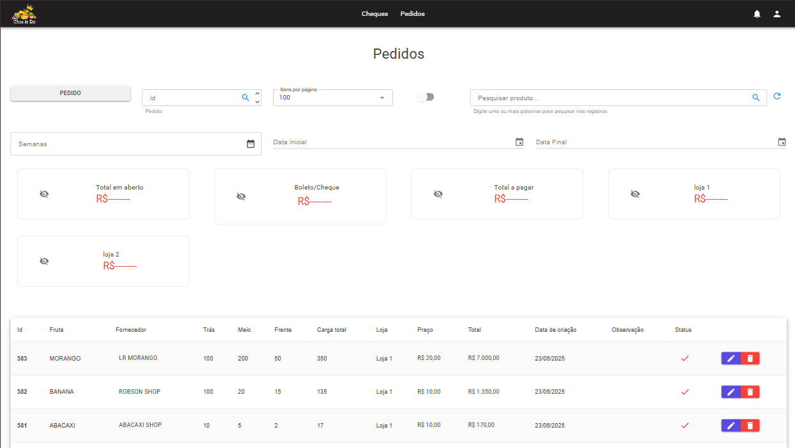
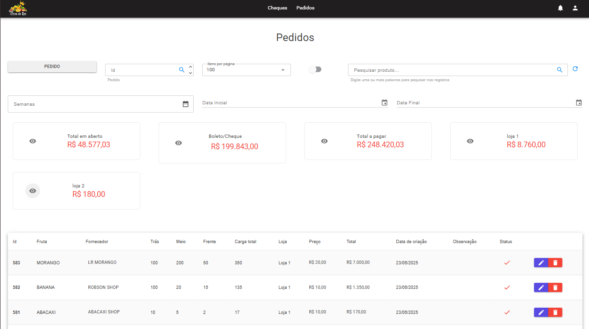
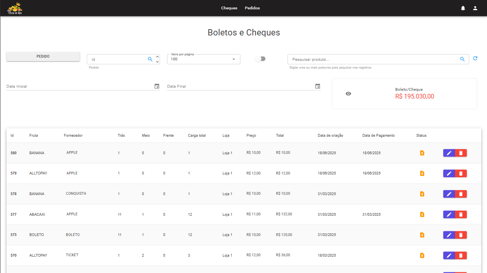

## 🛒 Sistema de Controle de Compras para Feirante

Projeto desenvolvido para um feirante, com foco no controle das compras feitas junto a fornecedores.

O sistema conta com duas interfaces principais:

- **Tela 1:** Controle de compras realizadas via **PIX, cartão e outros meios de pagamento**.  

  

- **Tela 2:** Gerenciamento de compras feitas por **cheques e boletos**.  

Essa aplicação ajuda a manter a organização financeira e a rastreabilidade dos pagamentos de forma clara e separada.
